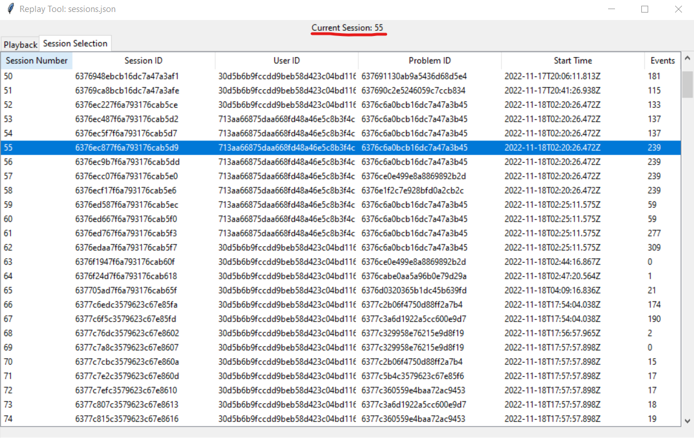

Replay
==============

Running the replay tool
*********************************

To start a replay, simply execute the script with the data file as the command line argument.
The file specified must be a properly formatted JSON data file as retrieved from the server. 
The file argument can be the relative or absolute path for the file.

For example, to open a file called "sessions.json" that is located in the same directory as the script:

.. code-block:: bash

    python replay.py sessions.json

After running the script, the tool will open in a new window.

In order to start playback, you must first select a session from the file. Click on the "Session Selection" tab
to open the session selection view. 

.. image:: images/replay2.png
    :width: 600

Once you have switched views, select the desired session by clicking on it. The current session will update above to indicate that you have opened that session.

Now, click on the "Playback" tab to return to playback, the current session being replayed will still be the one you have selected.

.. image:: images/replay4.png
    :width: 600

Simply click "Play" to start the playback, you can adjust the playback speed using the dropdown, or scrub through the playback using one of the two scrub bars.

Errors and Troubleshooting
*********************************

Why do certain sessions not appear in the sessions view?
    If a particualr session does not have all of the fields normally required of a session, it will not be displayed in the sessions view.
    You can identify which sesssions were ignored by looking at the console output of the script.